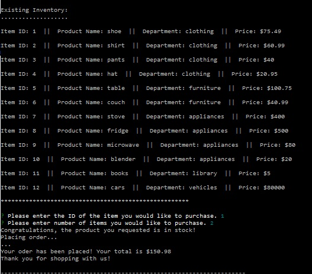

# Bamazon

## Node.js & MySQL

# Overview

In this activity, you'll be creating an Amazon-like storefront with the MySQL skills you learned this week. The app will take in orders from customers and deplete stock from the store's inventory. As a bonus task, you can program your app to track product sales across your store's departments and then provide a summary of the highest-grossing departments in the store.
Make sure you save and require the MySQL and Inquirer npm packages in your homework files--your app will need them for data input and storage.

# Database

# Customer Purchase:

## Not Enough Stock:

## Purchase: Successful:

# Manager View:

## Manager Menu:

## Manager View Inventory:

## Manager View Low Inventory (less than 10):

## Manager Update Product Stock:

## Manager Add New Product:
